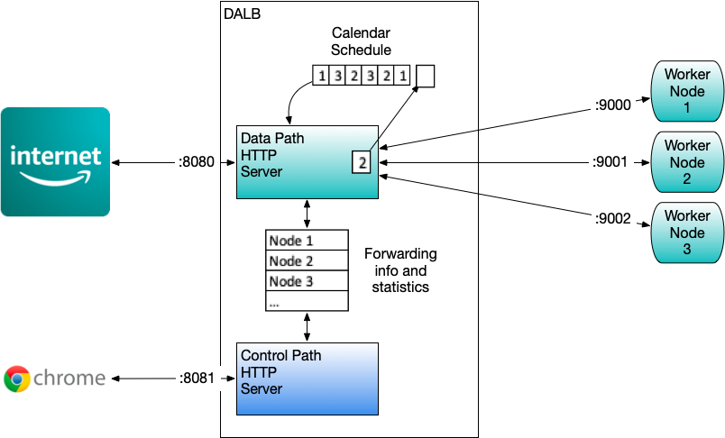

# jdalb/internal
## Go Dynamic Application Load Balancer

This Application Load Balancer accepts incomming HTTP requests and distributes them to worker nodes.

Each worker node has an IP address, port and the maximum number of outstanding transactions that can be queued. The system monitors the work nodes performance by measuring the time taken for each transaction. 

The rebalancer(TBD) runs periodically and examines the performance of each worker node. The lower performing worker nodes will be given less data traffic while the better performing worker nodes will get an increase.

The Scheduling algorithm uses a Weighted Round Robin calendar to avoid the computational overhead for determining the next available worker node using mathmatical formula.

By using a calendar WRR, the system behavior is deterministic inbetween rebalance events.

(TODO) add system and worker node performance history tracking.



## Code Layout
THe code layout follows https://github.com/golang-standards/project-layout

## Build
Go version go1.15 was used to build this application.

To build dalb/internal, enter:

```sh
make install
```
on the command line. The system will build and test each component.

The resulting binary is:

```sh
bin/dalb
```
## Running
bin/dalb creates 2 HTTP servers, each listening on different ports.

- data path - default port is 8080
- control path - default port is 8081

The different ports enable dalb/internal management to be separate from the data forwarding path. The URL's used to manage go-dalb do not conflict with any URL that may occur in the load balancing path.

### Control path URL's
The following URL's are available to gather statistics and add worker nodes to dalb/internal

GET		/scheduler	returns global scheduler statistics

GET		/node			returns node statistics for all worker nodes

POST	/node			Adds a worker node to the scheduler 

## Testing
```shell script
go test -v -run TestIntegration
```

```shell script
=== RUN   TestIntegration
--- PASS: TestIntegration (1.01s)
    xintegrate_test.go:50: 
        scheduler
    xintegrate_test.go:51: Elapse time 1.004888668s
    xintegrate_test.go:52: Number of transactions 15000
    xintegrate_test.go:53: Average transaction time 60.027µs
    xintegrate_test.go:55: Min transaction time 44.241µs
    xintegrate_test.go:56: Max transaction time 1.717571ms
    xintegrate_test.go:57: 
        Worker Nodes
    xintegrate_test.go:59: ======================================
    xintegrate_test.go:60: Node: ::1 : 9002
    xintegrate_test.go:61: MaxTransactions 3
    xintegrate_test.go:62: Number of transactions 819
    xintegrate_test.go:63: Average transaction time 59.757µs
    xintegrate_test.go:65: Min transaction time 45.414µs
    xintegrate_test.go:66: Max transaction time 295.048µs
    xintegrate_test.go:59: ======================================
    xintegrate_test.go:60: Node: ::1 : 9003
    xintegrate_test.go:61: MaxTransactions 4
    xintegrate_test.go:62: Number of transactions 1092
    xintegrate_test.go:63: Average transaction time 61.989µs
    xintegrate_test.go:65: Min transaction time 45.056µs
    xintegrate_test.go:66: Max transaction time 329.432µs
    xintegrate_test.go:59: ======================================
    xintegrate_test.go:60: Node: ::1 : 9004
    xintegrate_test.go:61: MaxTransactions 5
    xintegrate_test.go:62: Number of transactions 1365
    xintegrate_test.go:63: Average transaction time 62.149µs
    xintegrate_test.go:65: Min transaction time 45.793µs
    xintegrate_test.go:66: Max transaction time 297.739µs
    xintegrate_test.go:59: ======================================
    xintegrate_test.go:60: Node: ::1 : 9007
    xintegrate_test.go:61: MaxTransactions 8
    xintegrate_test.go:62: Number of transactions 2184
    xintegrate_test.go:63: Average transaction time 59.749µs
    xintegrate_test.go:65: Min transaction time 44.88µs
    xintegrate_test.go:66: Max transaction time 556.346µs
    xintegrate_test.go:59: ======================================
    xintegrate_test.go:60: Node: ::1 : 9000
    xintegrate_test.go:61: MaxTransactions 1
    xintegrate_test.go:62: Number of transactions 273
    xintegrate_test.go:63: Average transaction time 68.768µs
    xintegrate_test.go:65: Min transaction time 46.371µs
    xintegrate_test.go:66: Max transaction time 1.717571ms
    xintegrate_test.go:59: ======================================
    xintegrate_test.go:60: Node: ::1 : 9001
    xintegrate_test.go:61: MaxTransactions 2
    xintegrate_test.go:62: Number of transactions 546
    xintegrate_test.go:63: Average transaction time 62.373µs
    xintegrate_test.go:65: Min transaction time 46.033µs
    xintegrate_test.go:66: Max transaction time 314.529µs
    xintegrate_test.go:59: ======================================
    xintegrate_test.go:60: Node: ::1 : 9008
    xintegrate_test.go:61: MaxTransactions 9
    xintegrate_test.go:62: Number of transactions 2452
    xintegrate_test.go:63: Average transaction time 58.904µs
    xintegrate_test.go:65: Min transaction time 44.743µs
    xintegrate_test.go:66: Max transaction time 321.919µs
    xintegrate_test.go:59: ======================================
    xintegrate_test.go:60: Node: ::1 : 9009
    xintegrate_test.go:61: MaxTransactions 10
    xintegrate_test.go:62: Number of transactions 2720
    xintegrate_test.go:63: Average transaction time 59.523µs
    xintegrate_test.go:65: Min transaction time 44.241µs
    xintegrate_test.go:66: Max transaction time 465.421µs
    xintegrate_test.go:59: ======================================
    xintegrate_test.go:60: Node: ::1 : 9005
    xintegrate_test.go:61: MaxTransactions 6
    xintegrate_test.go:62: Number of transactions 1638
    xintegrate_test.go:63: Average transaction time 58.38µs
    xintegrate_test.go:65: Min transaction time 45.29µs
    xintegrate_test.go:66: Max transaction time 278.695µs
    xintegrate_test.go:59: ======================================
    xintegrate_test.go:60: Node: ::1 : 9006
    xintegrate_test.go:61: MaxTransactions 7
    xintegrate_test.go:62: Number of transactions 1911
    xintegrate_test.go:63: Average transaction time 59.471µs
    xintegrate_test.go:65: Min transaction time 44.983µs
    xintegrate_test.go:66: Max transaction time 542.438µs
PASS
ok      dalb/internal 1.021s
```
